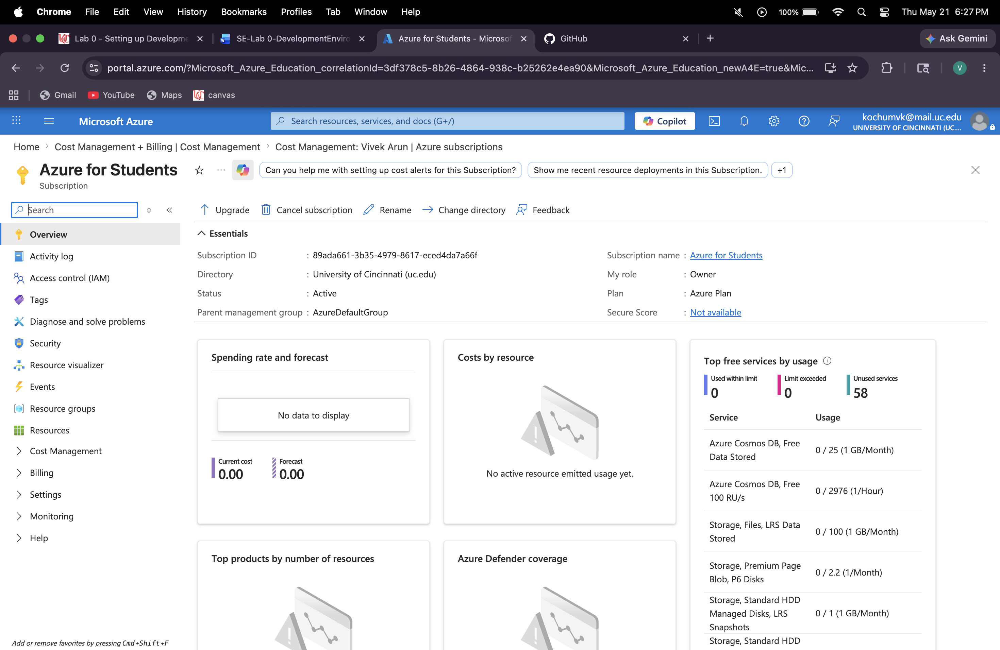
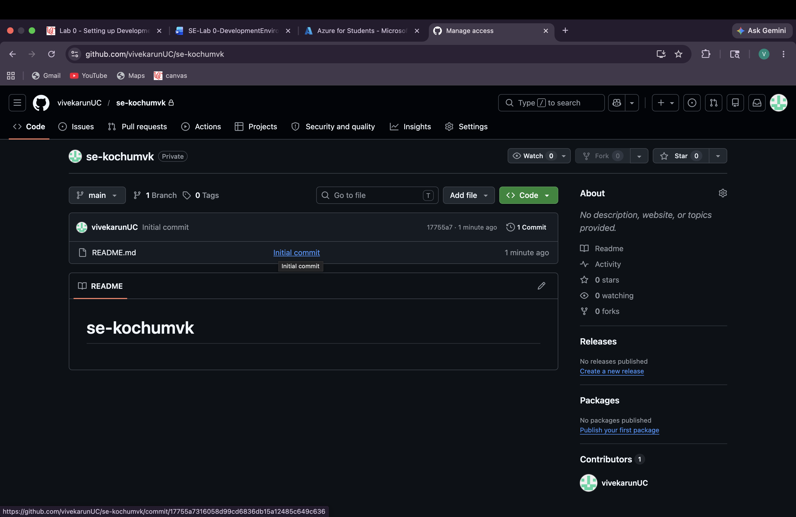
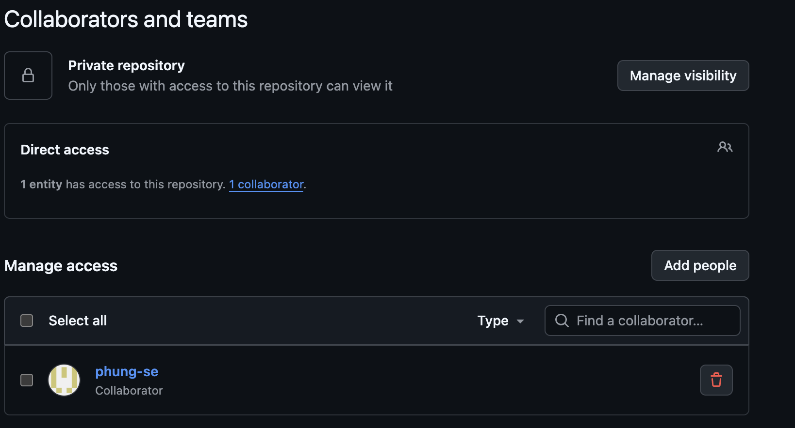
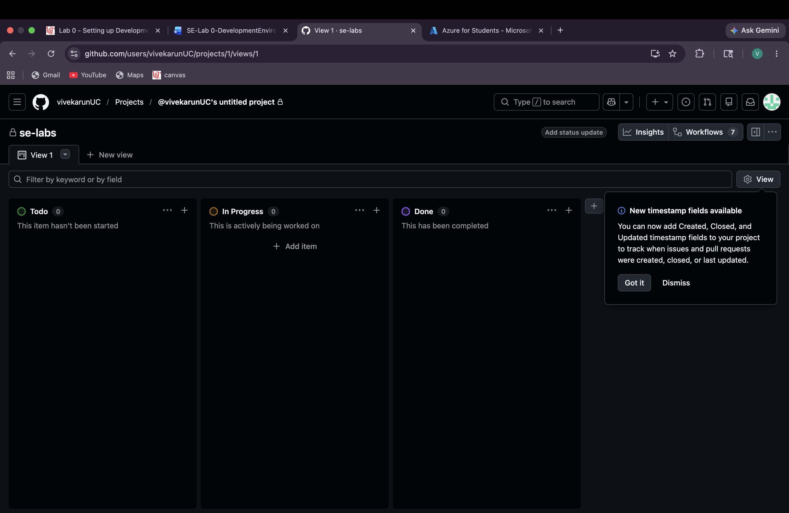
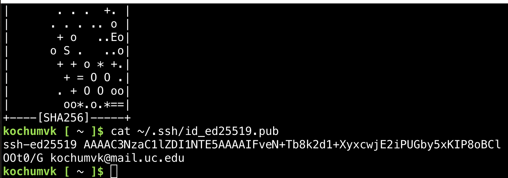
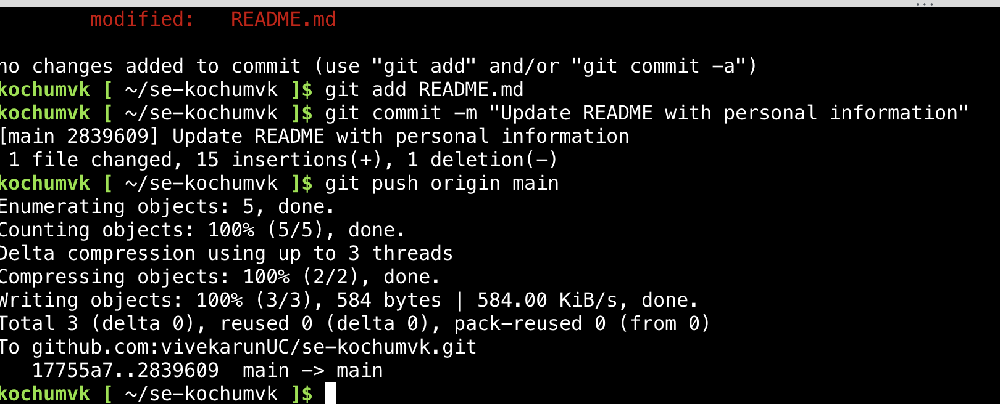

# EECE 3093C — Lab 0 Report

- **Course:** EECE 3093C / CS 3093C — Software Engineering, Summer 2026
- **Instructor:** Dr. Phu Phung
- **Name:** Vivek Arun
- **UC Email:** kochumvk@mail.uc.edu
- **Repository:** https://github.com/vivekarunUC/se-kochumvk.git

---

## The lab's overview

In this lab we set up our Azure student account and established a connection between our cloud shell and our github repository.

https://github.com/vivekarunUC/se-kochumvk/tree/main/labs/lab0

## Part I — Microsoft Azure for Students and Azure Cloud Shell

### Azure subscription

Markdown working example via:

### Cloud Shell version check

## Part II — GitHub Account and Private Repository

### Private repository

### phung-se invited as collaborator

### Projects permission check

## Part III — git Exercises

### SSH key generated

### Push success

